<!-- - - - - - - - - - - - - - - - - - - - - - - - - - - - - - - - - - - - -->
<!-- A1 (SE-2)
-->
# A1 - A5 : Setup

<!-- - - - - - - - - - - - - - - - - - - - - - - - - - - - - - - - - - - - -->

Goal of the following assignments is to set-up your laptop for
software development:

1. [A1: *Laptop/Terminal* - Setup](#a1-laptopterminal---setup) - 5 Pt

1. [A2: Understanding the *Terminal*](#a2-understanding-the-terminal) - 5 Pt

1. [A3: *Java* - Setup](#a3-java---setup) - 5 Pt

1. [A4: *git* - Setup](#a4-git---setup) - 5 Pt

1. [A5: *VSCode* - Setup](#a5-vscode---setup) - 5 Pt


<!-- - - - - - - - - - - - - - - - - - - - - - - - - - - - - - - - - - - - -->

&nbsp;

## A1: *Laptop/Terminal* - Setup

The terminal is the primary tool to interact with computers in software
development. *Mac* or *Linux* laptops have proper terminal software installed.
*Windows* laptops require Unix-compatible terminal emulator software.
Test your laptop that it has proper terminal software and install, if not.

**`->` Mac:**

- Read article by *Thomas Auinger:*
    [*"Setting up my new MacBook Air M3 for Java Development"*](https://medium.com/@thomas.auinger/setting-up-my-new-macbook-air-m3-for-java-development-fc609af738cb) and
    install:

    - the *Homebrew* [*brew*](https://brew.sh) package manager (if not already):

        ```sh
        /bin/bash -c "$(curl -fsSL https://raw.githubusercontent.com/Homebrew/install/HEAD/install.sh)"
        ```

    - Give user sudo-permissions (in order to install software from the terminal):

        ```
        sudo visudo
        ```

        Make sure the *%admin* entry appears as shown and add, if not:

        ```
        # User privilege specification
        root    ALL=(ALL) ALL
        %admin  ALL=(ALL) ALL
        ```

    - Install package [*coreutils*](https://formulae.brew.sh/formula/coreutils), which
        installs some needed *Unix* tools such as the *realpath* command.

    - Feel free to install other packages such as *"Tabby"* and *"Oh My Zsh"* for
        pretty prompts (although this is not needed).


**`->` Windows:**

- Follow steps in [*Setting up Cygwin*](10-Setup-cygwin.md) to install the
    [*cygwin*](https://www.cygwin.com) Unix-emulator. Mind specifically *step2* to:

    - switch from path prefix `/cygdrive/c` to `/c` and
    
    - change the *cygwin* *HOME*-directory from the installation path to a preferred
        location on your laptop (optional).


**`->` Linux:** -- you are all set.

&nbsp;

Test your configuration. Open a terminal and type:

```sh
# show real path to the current ('.') directory
realpath .      --> outputs path, e.g. /Users/thompson
                --> path on Windows must start with '/c', e.g. /c/Users/thompson

# show path of the 'HOME' directory
echo $HOME      --> /c/Sven1/svgr2

# change to the 'HOME' directory ('-l' long version)
cd

# show content of the 'HOME' directory ('-a' all file/directories)
ls -l

# show also 'dotfiles'
ls -la

# show content of the 'PATH' variable
echo $PATH
```


<!-- - - - - - - - - - - - - - - - - - - - - - - - - - - - - - - - - - - - -->

&nbsp;

## A2: Understanding the *Terminal*

Read [*Understanding the Terminal*](20-Understanding-the-Terminal.md) and learn
basic concepts or recall from the *Operating Systems* course.

Write-down short answers to questions:

1. What is a *shell*? - Name two *shells*.

1. What is *PATH*?

1. What is a (system-) process?

1. Draw basic processes involved in running a terminal application.

1. What is *UTF-8*? - How many bytes are needed to represent character *"A"* and *"€"* ?

1. What are *CR/LF* and *NL*? - What is the problem with *CR/LF* ?

1. Who is *Ken Thompson*?


Open a terminal and type:

```sh
# show content of the current directory ('-a' all file/directories)
ls -l

# show also 'dotfiles'
ls -la
```

What do you see?

```
$ ls -la
total 121
drwxr-xr-x 1 svgr2 Kein     0 Apr  6 18:21 .
drwxr-xr-x 1 svgr2 Kein     0 Aug  3  2024 ..
-rwxr-xr-x 1 svgr2 Kein 12907 Nov 13 15:44 .bashrc
-rw-r--r-- 1 svgr2 Kein  1117 Oct 15 17:59 .gitconfig
-rwxr-xr-x 1 svgr2 Kein 21529 Oct  9 18:54 .profile
drwxr-xr-x 1 svgr2 Kein     0 Oct  9 13:20 .ssh
-rw-r--r-- 1 svgr2 Kein  1056 Oct  9 18:21 .vimrc
-rw-r--r-- 1 svgr2 Kein   508 Oct  9 17:59 .zprofile
-rw-r--r-- 1 svgr2 Kein  1342 Oct  9 17:59 .zshrc
drwxr-xr-x 1 svgr2 Kein     0 Apr  6 18:27 workspaces
...
```

What does *'rwx'* mean?

Test your terminal that it properly handles *UTF-8* and *ANSI colors*.

```sh
echo "I won't pay 10€ for this."

echo -e "I won't pay 10\0342\0202\0254 (UTF-8 encoding) for this."

echo -e "Hello \033[31;1mWorld\033[0m - Hello \033[34;1mUniverse\033[0m !"
```

Output should show proper rendering of the *"€"* character:

```
I won't pay 10€ for this.
```

Coloring shows the effect of ANSI-code sequences.


What is *"PS1"*?

How are [*"pretty prompts"*](https://wiki.archlinux.org/title/Bash/Prompt_customization)
created?


<!-- - - - - - - - - - - - - - - - - - - - - - - - - - - - - - - - - - - - -->

&nbsp;

## A3: *Java* - Setup

*Java* comes in two major variaties:

- *Java JRE* - Java Runtime Environment only includes the 

    - `java` Virtual Machine and libraries needed during runtime to run
        compiled Java programs.

- *Java SDK* - Java Software Development Kit includes the full set of Java tools:

    - `javac` - the Java compiler to compile Java source code in `*.java` files
        to [*Portable Byte Code*](https://en.wikipedia.org/wiki/List_of_JVM_bytecode_instructions)
        in `*.class` files that can be loaded and executed by the JavaVM.

    - `javadoc` - the Java documentation compiler that generates HTML-documentation from
        comments in Java source code.

    - `jar` - the Java archiver that packages `*.class` files into `*.jar` (Java archive)
        files for distribution.

Other varieties include:

- *Java SE* standard edition, which is the free implementation distributed by
    *Oracle* and with *Open-JDK* that only includes the standard Java libraries.

- [*Jakarta EE*](https://en.wikipedia.org/wiki/Jakarta_EE) enterprise edition or
    *Java EE* (former name), which is a large framework for commercial Java
    software development.


Java is an open language specification, which means multiple implementations
exist, most prominently:

- [*Java from Oracle*](https://www.oracle.com/java) -
    [*Oracle*](https://en.wikipedia.org/wiki/Oracle_Corporation) is a dominat
    US data- and database company that aquired Java from *Sun Microsystems*
    in 2010 and owns Java.

- [*Open-JDK*](https://openjdk.org) is an open-source implementation of the
    Java Platform, Standard Edition (Java SE).

The [*Java Version history*](https://en.wikipedia.org/wiki/Java_version_history)
dates back to Jan 23, 1996 with *JDK 1.0*.

- *Java 26 SE* was released on March 17, 2026

- *LTS* (Long-term support) releases are *Java SE 21 (LTS)* and *Java SE 25 (LTS)*.

New *Java* releases often cause problems with existing code and libraries,
see example
[*"Unable to compile using java 25 \#3949"*](https://github.com/projectlombok/lombok/issues/3949)
for problems of *Java 25* with the [*lombok*](https://projectlombok.org/) library.

It is *adviced* to use the stable *Java 21* for the course. The more adventurous can
try the latest *Java*.

Verify your *Java* installation and install, if needed:

**`->` Mac:** - follow steps in article [*"Install Java on macOS"*](https://www.baeldung.com/java-macos-installation#using-homebrew-package-manager)
    using *brew* (mind to choose Java not older than *Java 21*, which is preferred).

**`->` Windows:** - download
    [*x64 installer*](https://www.oracle.com/de/java/technologies/downloads/#jdk21-windows)
    and install *Java*.

**`->` Linux:** - follow steps in article [*"ava auf Linux installieren"*](https://docs.fabricmc.net/de_de/players/installing-java/linux) depending on your *Linux* distribution.


&nbsp;

Test: open a terminal and show that tools are installed with proper (same) versions:

```sh
java --version          --> java 21 2023-09-19 LTS

javac --version         --> javac 21

javadoc --version       --> javadoc 21

jar --version           --> jar 21
```

Verify the Java - installation path is set to the *JAVA_HOME* environment variable:

```sh
echo $JAVA_HOME         --> /c/Program Files/Java/jdk-21
```

Create file `HelloWorld.java` in a directory: `~/workspaces/hello-world`
(`~` refers to the *HOME*-directory):

```java
public class HelloWorld {
    public static void main(String[] args) {
        System.out.println("Hello, World!");
    }
}
```

Compile and execute:

```sh
cd                                  # change to your HOME directory

mkdir -p ~/workspaces/hello-world   # make (mk) directories

cd workspaces/hello-world           # change into the 'hello-world' directory

# print the working directory
pwd                         --> /c/Sven1/svgr2/workspaces/hello-world

# create file '' in the directory - use an editor or IDE
...

cat HelloWorld.java         --> output the file content

# compile file 'HelloWorld.java'
javac HelloWorld.java       --> Java compiler creates file 'HelloWorld.class'

# run 'HelloWorld.class'
java HelloWorld             --> 'Hello, World!'
```


<!-- - - - - - - - - - - - - - - - - - - - - - - - - - - - - - - - - - - - -->

&nbsp;

## A4: *git* - Setup

[*Git*](https://git-scm.com) is a widely used
[*source-code management*](https://en.wikipedia.org/wiki/Comparison_of_version-control_software)
tool developed by *Linus Torvalds* for the large-scale, distributed development
of the *Linux*-kernel released in 2005.

*git* is primarily a ***local tool***. Test you have the local tool *git* installed:

```sh
git --version               --> git version 2.48.1.windows.1
```

[*GitLab*](https://en.wikipedia.org/wiki/GitLab) e.g.
[*https://gitlab.bht-berlin.de*](https://gitlab.bht-berlin.de) or
[*GitHub*](https://en.wikipedia.org/wiki/GitHub) (owned by *Microsoft*)
are ***services*** that are hosted on the network and are used to share code
with other developers by *pushing* and *pulling* local commits.

File [*.gitconfig*](https://github.com/sgra64/dotfiles/blob/main/.gitconfig)
in the user's *HOME* directory stores *git* user-settings. Those settings are
valid for all *git* projects a user has on a laptop.
File *.gitconfig* is created when a local *git* repository is initialized for
the first time.

Put project `hello-world` under git control:

```sh
ls -la                              # make sure you are in the project directory
```
```
total 6
drwxr-xr-x 1   0 Apr  6 22:15 ./
drwxr-xr-x 1   0 Apr  6 22:14 ../
-rw-r--r-- 1 427 Apr  6 22:15 HelloWorld.class
-rw-r--r-- 1 123 Apr  6 21:40 HelloWorld.java
```

If you have never created a local *git* repository on your laptop, you may
be asked to create a local *git* configuration file first.
File [*$HOME/.gitconfig*](https://github.com/sgra64/dotfiles/blob/main/.gitconfig)
is created in your *HOME*-directory with commands:

```sh
# add entries 'user.name' and 'user.email' to file '.gitconfig'
git config --global user.name "your name"
git config --global user.email "your@email.com"

# add more entries:
git config --global core.ignorecase true        # ignore upper/lower case in file names
git config --global core.autocrlf false         # disable crlf conversion on checkout
git config --global core.filemode false         # ignore filemode (rwx) changes
git config --global core.eol lf                 # always use newline '\n' as end-of-line

git config --global init.defaultBranch main     # 'main' is default branch, not 'master'
```

Show the content of file *$HOME/.gitconfig*:

```sh
cat $HOME/.gitconfig        # show '.gitconfig' file
```
```
[user]
    name = Sven Graupner                <-- your name
    email = sgraupner@bht-berlin.de     <-- your email address

[core]
    ignorecase = true       # ignore upper/lower case in file names
    autocrlf = false        # disable crlf conversion on checkout
    filemode = false        # ignore filemode (rwx) changes
    eol = lf                # always use newline '\n' as end-of-line

[init]
        defaultBranch = main
```


&nbsp;

Initialize the project directory as a *git* project:

```sh
# create new git project
git init --initial-branch=main      # initialize new local git repository
```

Git has created a new local git repository of the project that resides in a
sub-directory of the project named `.git` (mind the dot `.`):

```sh
ls -la                              # show the content of the project directory
```

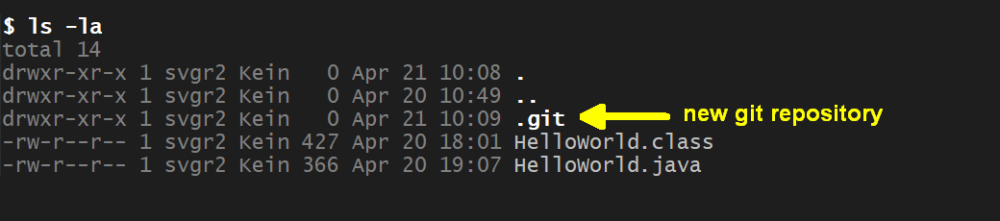
<!-- 
```
total 14
drwxr-xr-x 1   0 Apr  6 22:17 ./
drwxr-xr-x 1   0 Apr  6 22:14 ../
drwxr-xr-x 1   0 Apr  6 22:17 .git/             <-- new directory with git repository
-rw-r--r-- 1 427 Apr  6 22:15 HelloWorld.class
-rw-r--r-- 1 123 Apr  6 21:40 HelloWorld.java
```
-->


Next, create an empty root commit and tag the commit as *"root"*:

```sh
git commit --allow-empty -m "root commit (empty)"       # create empty root commit
git tag root                                            # tag commit as 'root'
```

Show the first commit:

```sh
# show the commit (full)
git log
```
<!-- 
```
commit fe36082634fbf491f0347664aa40c80b8f49a3ff (tag: root)
Author: Sven Graupner <sgraupner@bht-berlin.de>
Date:   Mon Apr 20 18:27:36 2026 +0200

    root commit (empty)
```
-->

The *commit-ID* are shown as 40-Byte hashes that are computed from the
content of the commit (*fe36082634fbf491f0347664aa40c80b8f49a3ff*).
The commit also contains the committers name (*Author*), the timestamp
when the commit was made and the commit message (*"root commit (empty)"*):

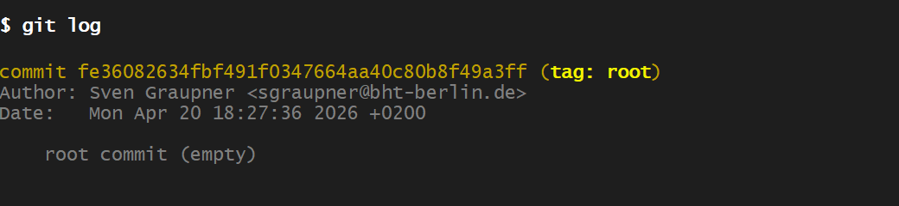


The short form of the command only shows the first 7-digits of the
*commit-ID* (*fe36082*) with the commit message:

```sh
# show the commit (short version)
git log --oneline
```

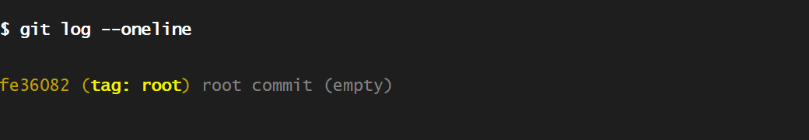
<!-- 
```
fe36082 (HEAD -> main, tag: root) root commit (empty)   <-- empty root commit
```
-->


Next, show the *git status* of the project:

```sh
git status
```

Output shows two files as *"untracked files"* (unknown the git):

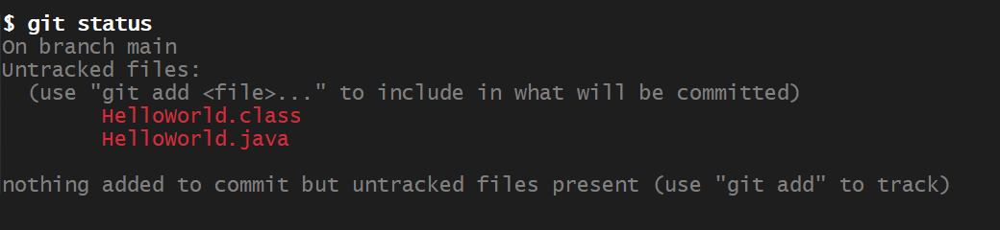

*Source code* (file `HelloWorld.java`) will be checked into the git repository
(*"committed"*), while *compiled code* (file `HelloWorld.class`) will not be
committed to the *git* repository.

&nbsp;

Learn about special file
[*.gitignore*](https://www.w3schools.com/git/git_ignore.asp).
The next step is to create a `.gitignore` file that tells *git* to ignore files
ending with `.class` from being committed or listed as *untracked files*.

Create a new file `.gitignore` (mind the dot `.` in front of the name) with content:

```sh
# make git to ignore files ending with '.class' (compiled classes)
*.class
```

Show the content of the new file.

```sh
cat .gitignore          # show content of the new '.gitignore' file

git status              # show the project status
```

The project's *git status* no longer shows file `HelloWorld.class` as *untracked*,
but the new file `.gitignore` appears:

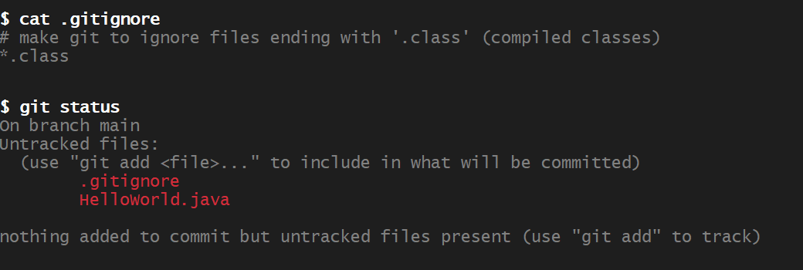
<!-- 
```
On branch main
Untracked files:
  (use "git add <file>..." to include in what will be committed)
        .gitignore
        HelloWorld.java
```
nothing added to commit but untracked files present (use "git add" to track)
-->


&nbsp;

Next, stage file `.gitignore` (*stage:* prepare for coming *commit*).

A *"git commit"* is a *set (snapshot) of files* that is recorded on a branch,
here branch: *main*. A commit is always added at the end of a branch after a
preceeding commit. A *branch* hence is a linear sequence of recorded commits.

Commits are created in two steps in *git*:

1. *"staging"* - a step that defines the set of files to be committed.
    During *staging*, files can be added or removed to/from the so-called
    *staging area* in the local repository that is defining the files for
    the upcomming commit. No commit is created during *staging* nor other
    harm can be done.

2. *"commit"* - all files from the *staging area* are bundled as a snapshot,
    assigned a unique *commit-ID* and appended at the end of the current branch.
    The *staging area* is cleared.

*"Staging"* is performed by the `git add <files>` command adding files to the
*"staging area"* (command `git reset <files>` removes files from the
*staging area*):

```sh
# stage file '.gitignore'
git add .gitignore

git status
```

Output shows the file `.gitignore` staged (in *green*):

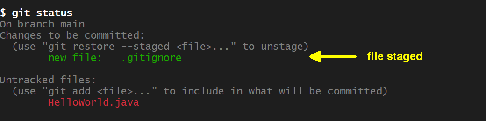
<!-- 
```
On branch main
Changes to be committed:
  (use "git restore --staged <file>..." to unstage)
        new file:   .gitignore
Untracked files:
  (use "git add <file>..." to include in what will be committed)
        HelloWorld.java
```
-->

Next, commit the staged content with message: *"add .gitignore"* and show the new commit:

```sh
# commit staged content
git commit -m "add .gitignore"

# show the new commit
git log --oneline
```

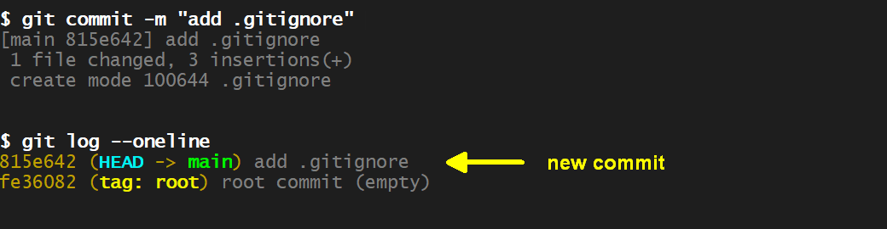
<!-- 
```
815e642 (HEAD -> main) add .gitignore
fe36082 (tag: root) root commit (empty)
```
-->

Next, commit and stage file `HelloWorld.java`:

```sh
# stage file 'HelloWorld.java'
git add HelloWorld.java

# commit staged file 'HelloWorld.java'
git commit -m "add HelloWorld.java"

# show the new commit
git log --oneline
```

The commit-log now shows three commmits:

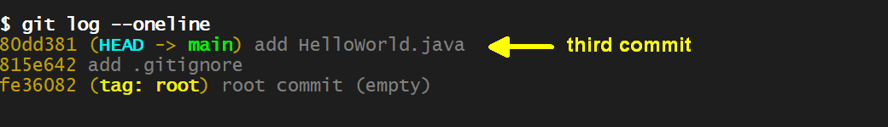
<!-- 
```
0de1d03 (HEAD -> main) add HelloWorld.java
815e642 add .gitignore
fe36082 (tag: root) root commit (empty)
```
-->

*HEAD* points to the last commit  of the *main* branch indicating the
commit the project directory (*"working tree"*) is synchronized with.

After commmits, the *"working tree is clean"*, which means there are no
uncommitted changes:

```sh
# show git status of the project
git status
```
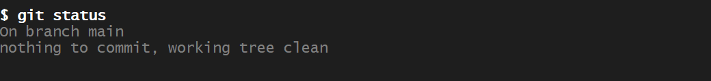
<!-- 
```
On branch main
nothing to commit, working tree clean
```
-->


Next, add *Javadoc* to file `HelloWorld.java`:

```java
/**
 * Class with static {@code main(String[] args)} function that
 * prints the {@code "Hello, World!"} message.
 */
public class HelloWorld {

    /**
     * Print the {@code "Hello, World!"} message.
     * @param args arguments passed from the command line
     */
    public static void main(String[] args) {
        System.out.println("Hello, World (with Javadoc)!");
    }
}
```

The *git* status of the project shows the change (called *"dirty state"*):

```sh
# show git status of the project
git status
```
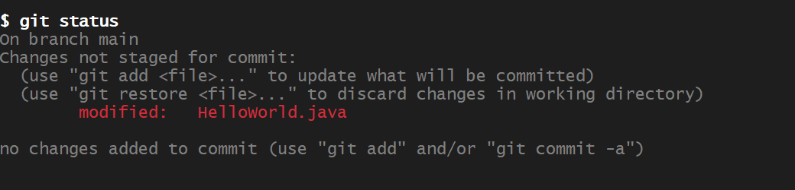
<!-- 
```
On branch main
Changes not staged for commit:
  (use "git add <file>..." to update what will be committed)
  (use "git restore <file>..." to discard changes in working directory)
        modified:   HelloWorld.java
no changes added to commit (use "git add" and/or "git commit -a")
```
-->


One can inspect changes with the *git diff* command. Green lines show new
or updated lines while red lines show prior lines that have been deleted:

```sh
# show the modifications made to file 'HelloWorld.java'
git diff HelloWorld.java
```
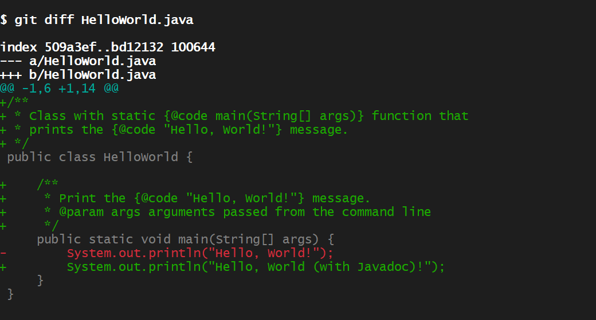
<!-- 
```
diff --git a/HelloWorld.java b/HelloWorld.java
index 509a3ef..bd12132 100644
--- a/HelloWorld.java
+++ b/HelloWorld.java
@@ -1,6 +1,14 @@
+/**
+ * Class with static {@code main(String[] args)} function that
+ * prints the {@code "Hello, World!"} message.
+ */
 public class HelloWorld {
+    /**
+     * Print the {@code "Hello, World!"} message.
+     * @param args arguments passed from the command line
+     */
     public static void main(String[] args) {
-        System.out.println("Hello, World!");
+        System.out.println("Hello, World (with Javadoc)!");
     }
 }
```
-->


Stage the changes (but don't commit yet):

```sh
# stage modifications made to file 'HelloWorld.java'
git add HelloWorld.java

# show git status of the project
git status
```
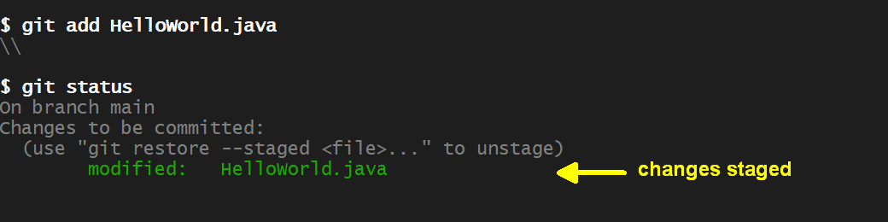
<!-- 
```
diff --git a/HelloWorld.java b/HelloWorld.java
index 509a3ef..bd12132 100644
--- a/HelloWorld.java
+++ b/HelloWorld.java
@@ -1,6 +1,14 @@
+/**
+ * Class with static {@code main(String[] args)} function that
+ * prints the {@code "Hello, World!"} message.
+ */
 public class HelloWorld {
+    /**
+     * Print the {@code "Hello, World!"} message.
+     * @param args arguments passed from the command line
+     */
     public static void main(String[] args) {
-        System.out.println("Hello, World!");
+        System.out.println("Hello, World (with Javadoc)!");
     }
 }
```
-->


Create the *HTML* from the doc-Strings using the `javadoc` compiler:

```sh
# generate java documentation, output (-d) is in directory 'javadoc'
javadoc -Xdoclint:-missing -d javadoc HelloWorld.java
```
```
Loading source file HelloWorld.java...
Constructing Javadoc information...
Building index for all the packages and classes...
Standard Doclet version 21+35-LTS-2513
Building tree for all the packages and classes...
Generating javadoc\HelloWorld.html...
Generating javadoc\package-summary.html...
Generating javadoc\package-tree.html...
Generating javadoc\overview-tree.html...
Building index for all classes...
Generating javadoc\allclasses-index.html...
Generating javadoc\allpackages-index.html...
Generating javadoc\index-all.html...
Generating javadoc\search.html...
Generating javadoc\index.html...
Generating javadoc\help-doc.html...
```

Show the new directory `javadoc` in the project directory:

```sh
ls -la                                  # show content of the project directory
```
```
total 23
drwxr-xr-x 1 svgr2 Kein   0 Apr 25 23:24 .
drwxr-xr-x 1 svgr2 Kein   0 Apr 23 13:22 ..
drwxr-xr-x 1 svgr2 Kein   0 Apr 25 23:21 .git
-rw-r--r-- 1 svgr2 Kein  76 Apr 21 10:33 .gitignore
-rw-r--r-- 1 svgr2 Kein 427 Apr 20 18:01 HelloWorld.class
-rw-r--r-- 1 svgr2 Kein 382 Apr 25 23:14 HelloWorld.java
drwxr-xr-x 1 svgr2 Kein   0 Apr 25 23:24 javadoc            <-- new directory containing HTML
```

Open file `javadoc/index.html` in a browser to see the documentation:


&nbsp;

Checking the status of the project, we find the previously staged changes
in file `HelloWorld.java` and the new directory `javadoc` as *"untracked files"*:

```sh
git status                              # show status of the project directory
```
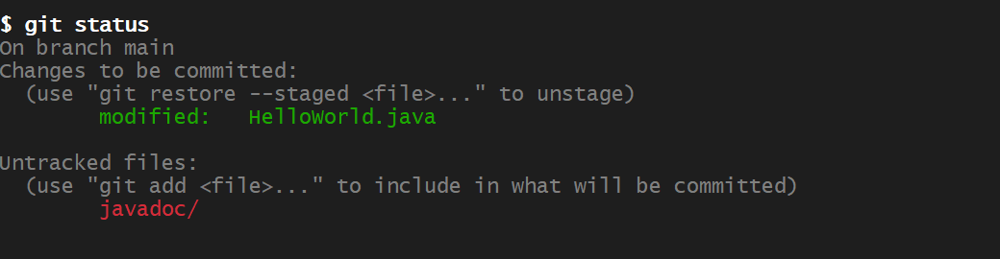
<!-- 
On branch main
Changes to be committed:
  (use "git restore --staged <file>..." to unstage)
        modified:   HelloWorld.java
Untracked files:
  (use "git add <file>..." to include in what will be committed)
        javadoc/
-->

Directory `javadoc` contains compiled content that hence should not be
recorded. Consequently, add the directory to file `.gitignore`.

```sh
# add 'javadoc' to file '.gitignore'

# after that, show the content of file '.gitignore'
cat .gitignore
```
```
# make git to ignore files ending with '.class' (compiled classes)
*.class
javadoc/                                <-- new line added
```

The *git* status of the project has changed: directory `javadoc` is now being
ignored, but changes in file `.gitignore` are shown as modification:

```sh
git status                              # show status of the project directory
```
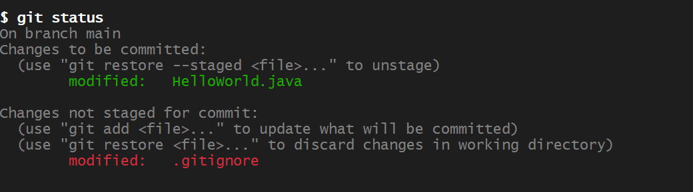
<!-- 
On branch main
Changes to be committed:
  (use "git restore --staged <file>..." to unstage)
        modified:   HelloWorld.java
Changes not staged for commit:
  (use "git add <file>..." to update what will be committed)
  (use "git restore <file>..." to discard changes in working directory)
        modified:   .gitignore
-->

Stage the change to file `.gitignore` and show the *git* status:

```sh
git add .gitignore                      # stage changes in file '.gitignore'

git status                              # show status of the project directory
```
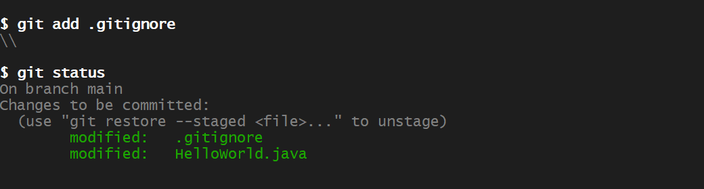
<!-- 
On branch main
Changes to be committed:
  (use "git restore --staged <file>..." to unstage)
        modified:   .gitignore
        modified:   HelloWorld.java
-->

Both staged changes are related to the added *Javadoc* and can be committed
with message: *"add Javadoc"*:

```sh
git commit -m "add Javadoc"             # commit staged changes
```
```
[main 5fd5c21] add Javadoc
 2 files changed, 10 insertions(+), 2 deletions(-)
```

After the commit, the *git* status is clean and the *git* log shows the
new commit:

```sh
git status                              # show status of the project directory

git log --oneline
```
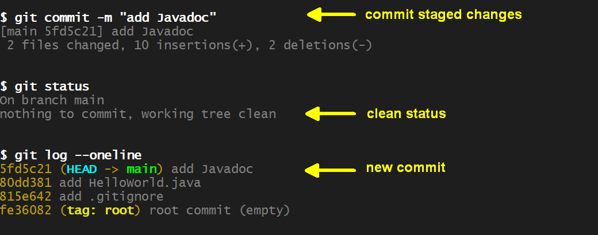
<!-- 
On branch main
Changes to be committed:
  (use "git restore --staged <file>..." to unstage)
        modified:   HelloWorld.java
Changes not staged for commit:
  (use "git add <file>..." to update what will be committed)
  (use "git restore <file>..." to discard changes in working directory)
        modified:   .gitignore
-->


The next command shows the difference between the current (last) commit
addressed by `HEAD` and the previous commit addressed by `HEAD~1`
(read: *HEAD* minus 1, the tilde sign `'~'` is used for the minus sign
since `'-'` has other effects in shell commands):

```sh
# show the differences recorded in the last commit
git diff HEAD~1..HEAD --name-status
```
```
M       .gitignore              <-- 'M' means file '.gitignore' has modifications
M       HelloWorld.java         <-- 'M' means file 'HelloWorld.java' has modifications
```

One can also inspect changes recorded in individual files between commits.
The next command shows the line (green) added to file `.gitignore`:

```sh
# show the difference in file '.gitignore'
git diff HEAD~1..HEAD -- .gitignore
```
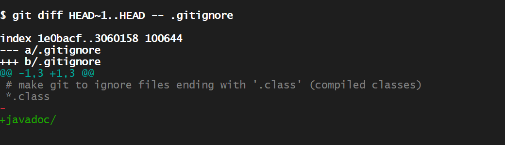
<!-- 
diff --git a/.gitignore b/.gitignore
index 1e0bacf..3060158 100644
--- a/.gitignore
+++ b/.gitignore
@@ -1,3 +1,3 @@
 # make git to ignore files ending with '.class' (compiled classes)
 *.class
-
+javadoc/
-->


&nbsp;

Take notes and answer questions:

1. Where is a local *.git* repository stored?

1. What is a *commit*?

1. What is a *branch*?

1. Why was file `HelloWorld.java` commited, `HelloWorld.class` and directory
    `javadoc` not?

1. What do people mean when they say the project directory is in a *"clean state"* ?

1. When is a *project state* *"dirty"* ? How can *"dirty state"* be cleaned up?

1. Can commits be changed after they have been committed (e.g. files added or
    removed)?


<!-- - - - - - - - - - - - - - - - - - - - - - - - - - - - - - - - - - - - -->

&nbsp;

## A5: *VSCode* - Setup

[*Visual Studio Code (VSCode)*](https://code.visualstudio.com) by *Microsoft* is a modern,
popular *IDE* (Integrated Development Environment) with:

- Multiple programming languages support (*"polyglot"*).

- A large choice of extensions (e.g. *"Java extension pack"*, *"Code Runner"* extension).

- Ability to develop in remote environments (cloud, containers) over the network.

- Built-in *AI integration* (Microsoft's *Co-Pilot*) or through extensions, e.g. *Claude*
    and others.


For this course, following *VSCode* extensions need to be installed:

- [*Extension Pack for Java*](https://marketplace.visualstudio.com/items?itemName=vscjava.vscode-java-pack) -- required.

- [*Code Runner*](https://marketplace.visualstudio.com/items?itemName=formulahendry.code-runner) -- recommended.

`->` Make sure you can start *VSCode* from the terminal, e.g. by setting *PATH* in
`.bashrc`.

`->` *VSCode* opens each project separately (not multiple projects or entire
workspaces at once, which is in contrast to older *IDE* such as *eclipse*).

`->` Hence, *VSCode* must be started from within the project directory.

Navigate to the project directory and start *VSCode*:

```sh
cd ~/workspaces/hello-world         # cd to into the project directory

code .                              # start VSCode in this '.' (dot) current directory
```

*VSCode* will open and show project files.

Run the *HelloWorld* Program with:

- the internal *launcher* (see screenshot) or with

- *Code Runner* that is activated by (default): `<Ctrl> + <Alt> + N`

Output of the program should appear in the integrated Terminal panel (launcher) or
in the Output panel (Code Runner).

&nbsp;


